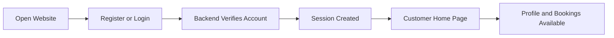
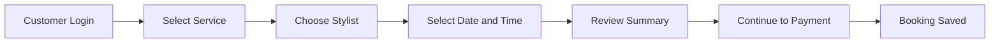
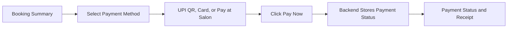
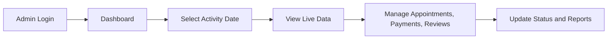
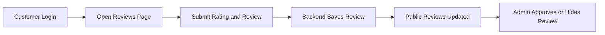
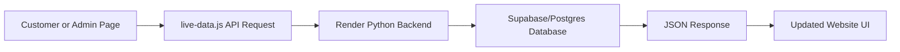

# 3.2 Workflow Diagrams - Glow & Grace Salon

This section follows the workflow-diagram style from the field project documentation format. Each flow includes a short flow representation and an editable Mermaid diagram.

## 3.2.1 Customer Account and Login Flow

This flow shows how a customer enters the website, creates or accesses an account, and reaches the customer side of the system.

**Flow Representation:**

Open Website -> Register or Login -> Backend Verifies Account -> Session Created -> Customer Home Page -> Profile and Bookings Available

## 3.2.2 Customer Appointment Booking Flow

This flow explains how a logged-in customer books a salon appointment from service selection to final booking storage.

**Flow Representation:**

Customer Login -> Select Service -> Choose Stylist -> Select Date and Time -> Review Summary -> Continue to Payment -> Booking Saved

## 3.2.3 Payment Processing Flow

This flow shows how payment information is handled and how the payment status page displays receipt details after payment.

**Flow Representation:**

Booking Summary -> Select Payment Method -> UPI QR, Card, or Pay at Salon -> Click Pay Now -> Backend Stores Payment Status -> Payment Status and Receipt

## 3.2.4 Admin Management Flow

This flow describes the admin side where salon staff monitor daily data, update appointment/payment status, and review reports.

**Flow Representation:**

Admin Login -> Dashboard -> Select Activity Date -> View Live Data -> Manage Appointments, Payments, Reviews -> Update Status and Reports

## 3.2.5 Review Management Flow

This flow shows how customer reviews are submitted, stored, displayed publicly, and controlled from the admin panel.

**Flow Representation:**

Customer Login -> Open Reviews Page -> Submit Rating and Review -> Backend Saves Review -> Public Reviews Updated -> Admin Approves or Hides Review

## 3.2.6 Live Data and Database Flow

This flow explains how frontend pages communicate with the hosted backend and live database for appointments, payments, and reviews.

**Flow Representation:**

Customer or Admin Page -> live-data.js API Request -> Render Python Backend -> Supabase/Postgres Database -> JSON Response -> Updated Website UI

## System Workflow Explanation

The system works through two main interfaces: the customer website and the admin panel. Customers register or login, book appointments, complete payment or choose pay at salon, and then view their appointment and payment status. Admin users login separately, view all live appointment data, filter activity by date, manage payment and appointment status, and review customer feedback. The frontend communicates with the Python backend through API requests, and the backend stores live data in the Supabase/Postgres database.